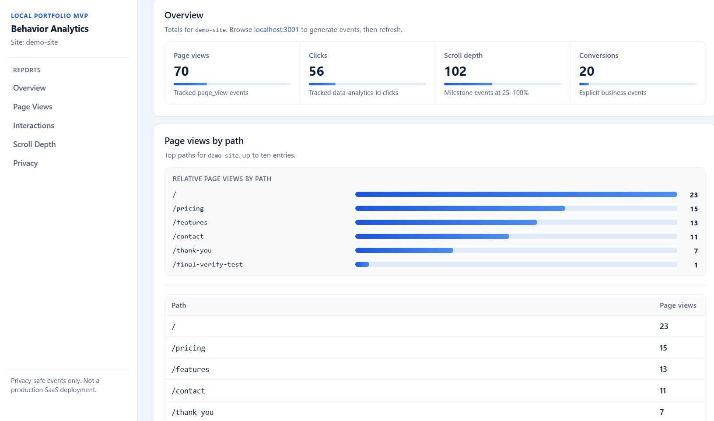
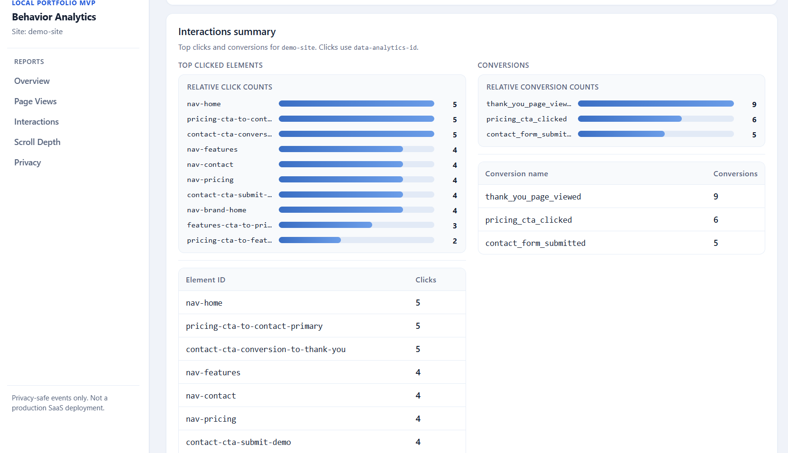
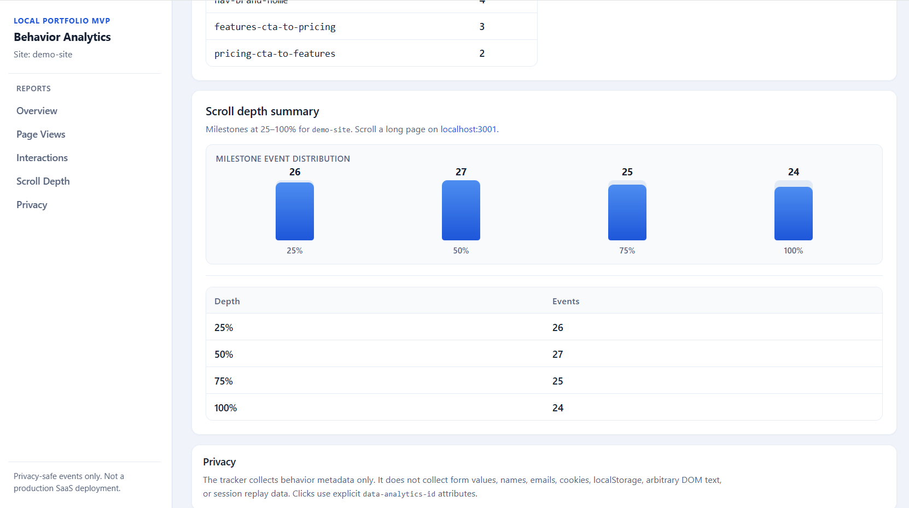

# Behavior Analytics MVP

[](https://github.com/KaterynaSukharevska/behavior-analytics/actions/workflows/ci.yml)

**Behavior Analytics MVP** is a privacy-conscious **website behavior analytics** project built as a **local-first portfolio/career MVP** — for demonstrating full-stack TypeScript work to recruiters and interviewers.

It is **not** a production SaaS: there is no deployment, auth, or production monitoring in the current implementation. Everything in this README describes what runs locally today.

**What you get:** a Next.js demo site, a browser tracker SDK, a Fastify ingest API, PostgreSQL event storage (Prisma), REST reporting endpoints, and a Next.js dashboard. Detailed walkthroughs live in [`docs/portfolio/`](docs/portfolio/) (linked below).

## What This Project Demonstrates

- full-stack TypeScript application structure across frontend, backend, and shared packages;
- privacy-conscious tracker SDK design;
- Fastify ingest API and REST reporting endpoints;
- Zod runtime validation at API boundaries;
- Prisma/PostgreSQL persistence for analytics events;
- Next.js dashboard reporting UI;
- CSS-only visual reporting for page views and scroll depth;
- Vitest tests and GitHub Actions CI checks;
- phased MVP delivery with clear scope boundaries.

## Why This Project Exists

This project demonstrates modern full-stack TypeScript product development for a realistic analytics workflow:

- browser analytics tracking with privacy constraints;
- shared TypeScript contracts and Zod runtime validation;
- Fastify API design with safe public errors;
- PostgreSQL persistence through Prisma;
- query-time reporting endpoints;
- dashboard UI with loading, error, empty, and success states;
- focused Vitest coverage for reporting and tracker privacy behavior.
- basic GitHub Actions CI for pull requests and pushes to `main`.

It is intentionally presented as a local-first portfolio/career project, not as a production SaaS.

## Implemented Flow

```txt
demo-site
  → tracker SDK
  → ingest API
  → Zod validation
  → Prisma
  → PostgreSQL analytics_events
  → reporting API
  → dashboard UI
```

In plain language:

1. The demo site emits privacy-safe behavior events through the tracker SDK.
2. The ingest API receives `POST /api/events` and validates payloads with Zod.
3. Prisma persists valid events to PostgreSQL (`analytics_events`).
4. Reporting endpoints aggregate stored events (`GET /api/reports/*?siteId=demo-site`).
5. The dashboard fetches those endpoints and renders report sections (overview, page views by path, interactions summary, scroll depth summary).

REST-first, beginner-readable architecture. See [`docs/architecture/data-flow.en.md`](docs/architecture/data-flow.en.md) for more detail.

## Demo Screenshots

This local demo shows the implemented flow from demo-site tracking events into the ingest API, PostgreSQL, reporting API, and dashboard UI. The images below are **portfolio evidence from a real `localhost` run** — not production deployment, not customer data, and not edited metrics.

| Dashboard overview & page views | Interactions report | Scroll depth & privacy |
|--------------------|--------------------|----------------|
|  |  |  |

More captures and naming rules: [`docs/assets/screenshots/README.md`](docs/assets/screenshots/README.md). Capture guidance: [`docs/portfolio/demo-screenshots-plan.md`](docs/portfolio/demo-screenshots-plan.md).

## Tech Stack

| Area | Technology |
|------|------------|
| Monorepo | npm workspaces |
| Language | TypeScript |
| Dashboard | Next.js (React) |
| Demo site | Next.js (React) |
| Ingest API | Fastify |
| Database | PostgreSQL via Docker Compose |
| DB toolkit | Prisma |
| Runtime validation | Zod |
| Testing | Vitest |
| API style | REST-first |
| CI | GitHub Actions (workspace typechecks + Vitest on PRs and `main`) |

**Not used:** GraphQL, microfrontends.

## Current Features

- Page view tracking
- Click tracking through explicit `data-analytics-id` attributes
- Scroll depth tracking for 25%, 50%, 75%, and 100% milestones
- Explicit conversion tracking
- Zod event validation before persistence
- PostgreSQL raw event persistence in `analytics_events`
- Reporting endpoints for overview, page views by path, interactions, and scroll depth
- Dashboard report sections for overview metrics, top paths, clicked elements, conversions, and scroll depth
- Reporting helper tests
- Reporting endpoint tests
- Tracker privacy tests
- Polished local dashboard UI using plain global CSS

## Privacy Principles

Privacy-safe tracking is a core design constraint. The tracker does **not** collect:

- form values;
- names;
- emails;
- phone numbers;
- message text;
- cookies;
- `localStorage` contents;
- arbitrary DOM text;
- DOM snapshots;
- session replay data.

Click tracking uses explicit safe identifiers such as `data-analytics-id` (not button or link text). Conversions are explicit business events from code. See [`docs/architecture/privacy-security.en.md`](docs/architecture/privacy-security.en.md).

## Local URLs

| Service | URL |
|---------|-----|
| Dashboard | http://localhost:3000 |
| Demo Site | http://localhost:3001 |
| Ingest API | http://localhost:4000 |
| Health | http://localhost:4000/api/health |
| Events API | http://localhost:4000/api/events |
| PostgreSQL | localhost:5432 |

## Local Demo

After [Local Setup](#local-setup) below, open:

| Service | URL |
|---------|-----|
| Dashboard | http://localhost:3000 |
| Demo site | http://localhost:3001 |
| Ingest API health | http://localhost:4000/api/health |

**Before interviews:** follow [`docs/portfolio/local-demo-checklist.md`](docs/portfolio/local-demo-checklist.md) (health, reports, dashboard cards, troubleshooting, clean restart).

**Portfolio & interview docs:** see [Portfolio & interview docs](#portfolio--interview-docs) — pitches, storyline, Q&A, screenshots plan, fallback script.

## Local Setup

Prerequisites: Node.js 20+, npm, Docker, and Docker Compose.

From the repository root:

```bash
npm install
```

Start PostgreSQL:

```bash
docker compose up -d postgres
docker compose ps
```

Prepare Prisma if needed:

```bash
npm run db:generate
npm run db:migrate
```

Run the local apps in separate terminals:

```bash
npm run dev --workspace=@behavior-analytics/ingest-api
npm run dev --workspace=@behavior-analytics/dashboard
npm run dev --workspace=@behavior-analytics/demo-site
```

Then open:

- dashboard: http://localhost:3000
- demo site: http://localhost:3001
- health check: http://localhost:4000/api/health

## Testing And Typechecks

Basic GitHub Actions CI runs on pull requests and pushes to `main` with Node.js 20 and `npm ci`.

Current CI checks:

```bash
npm run db:generate
npm run typecheck -w @behavior-analytics/types
npm run typecheck -w @behavior-analytics/analytics-core
npm run typecheck -w @behavior-analytics/tracker
npm run typecheck -w @behavior-analytics/ingest-api
npm run typecheck -w @behavior-analytics/dashboard
npm run typecheck -w @behavior-analytics/demo-site
npm run test -w @behavior-analytics/analytics-core
npm run test -w @behavior-analytics/tracker
npm run test -w @behavior-analytics/ingest-api
```

Useful Prisma checks:

```bash
npm run db:validate
npm run db:status
```

## Monorepo Structure

```txt
apps/
  dashboard/          Next.js dashboard UI
  demo-site/          Next.js demo website that emits events
  ingest-api/         Fastify event ingestion and reporting API

packages/
  tracker/            Browser tracking SDK
  types/              Shared TypeScript event types
  analytics-core/     Zod validation schemas and tests
  config/             Shared config placeholder

prisma/               Prisma schema and migrations
docs/                 Product, architecture, setup, and phase docs
scripts/              Local helper scripts
```

## Portfolio & interview docs

Use these for GitHub visitors, recruiters, and technical interviews (details stay in `docs/`, not duplicated here):

| Document | Use for |
|----------|---------|
| [`local-demo-checklist.md`](docs/portfolio/local-demo-checklist.md) | Run and verify the local demo before presenting |
| [`demo-screenshots-plan.md`](docs/portfolio/demo-screenshots-plan.md) | Screenshot sequence and capture rules |
| [`assets/screenshots/README.md`](docs/assets/screenshots/README.md) | Committed local demo screenshots (see [Demo Screenshots](#demo-screenshots)) |
| [`interview-storyline.md`](docs/portfolio/interview-storyline.md) | 5-/10-minute talk track and per-screen narrative |
| [`interview-walkthrough-script.md`](docs/portfolio/interview-walkthrough-script.md) | Timed 5–7 minute walkthrough |
| [`technical-highlights.md`](docs/portfolio/technical-highlights.md) | Architecture → skills mapping |
| [`qa-and-objection-handling.md`](docs/portfolio/qa-and-objection-handling.md) | Common questions and honest objections |
| [`30-second-60-second-120-second-pitch.md`](docs/portfolio/30-second-60-second-120-second-pitch.md) | Short spoken pitches |
| [`interview-prep-checklist.md`](docs/portfolio/interview-prep-checklist.md) | 30 minutes before an interview |
| [`demo-day-fallback-script.md`](docs/portfolio/demo-day-fallback-script.md) | When live demo is unavailable |
| [`final-portfolio-review-checklist.md`](docs/portfolio/final-portfolio-review-checklist.md) | Final GitHub/portfolio readiness review |
| [`phase-11-final-review-notes.md`](docs/portfolio/phase-11-final-review-notes.md) | Phase 11.1 portfolio review outcomes |
| [`phase-11-demo-rehearsal-notes.md`](docs/portfolio/phase-11-demo-rehearsal-notes.md) | Phase 11.2 interview demo rehearsal flow |
| [`phase-11-closure-summary.md`](docs/portfolio/phase-11-closure-summary.md) | Phase 11 closure — final portfolio readiness decision |
| [`phase-12-dashboard-visual-upgrade-summary.md`](docs/portfolio/phase-12-dashboard-visual-upgrade-summary.md) | Phase 12 closure — optional dashboard visual upgrade |

Full docs index: [`docs/README.md`](docs/README.md).

## Current Limitations

Intentional scope boundaries for this local-first MVP (do not present as production-ready):

- no auth
- no rate limiting
- no deployment yet (plan only: [`docs/deployment/deployment-plan.en.md`](docs/deployment/deployment-plan.en.md))
- no production monitoring/logging strategy
- no date filters
- no aggregation tables or materialized views
- no background jobs
- no batching or offline retry
- no `session_start` / `session_end` emission from the tracker (types/schemas exist; tracker does not emit yet)
- no E2E or screenshot testing automation
- **not production SaaS**

## Documentation

- [`docs/README.md`](docs/README.md) — full documentation index (architecture, setup, product, phase handoffs)
- [`docs/architecture/architecture.en.md`](docs/architecture/architecture.en.md) — technical architecture
- [`docs/architecture/data-flow.en.md`](docs/architecture/data-flow.en.md) — event and reporting data flow
- [`docs/architecture/privacy-security.en.md`](docs/architecture/privacy-security.en.md) — privacy and security rules
- [`docs/setup/local-development.en.md`](docs/setup/local-development.en.md) — local setup notes
- [`docs/setup/tracker-local-smoke.en.md`](docs/setup/tracker-local-smoke.en.md) — tracker smoke checklist
- [`docs/setup/dashboard-reporting-smoke.en.md`](docs/setup/dashboard-reporting-smoke.en.md) — dashboard/reporting smoke checklist
- [`docs/phase-11-context.md`](docs/phase-11-context.md) — current phase handoff (interview demo readiness and final portfolio QA)
- [`docs/phase-10-context.md`](docs/phase-10-context.md) — Phase 10 handoff (demo evidence and screenshot assets)
- [`docs/phase-9-context.md`](docs/phase-9-context.md) — Phase 9 handoff and completion summary
